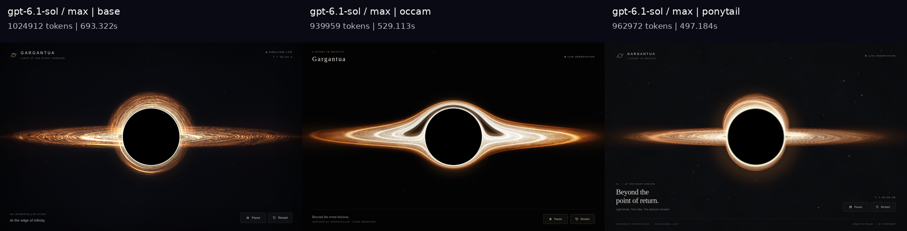
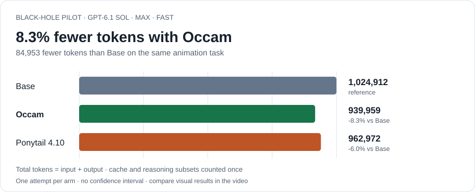
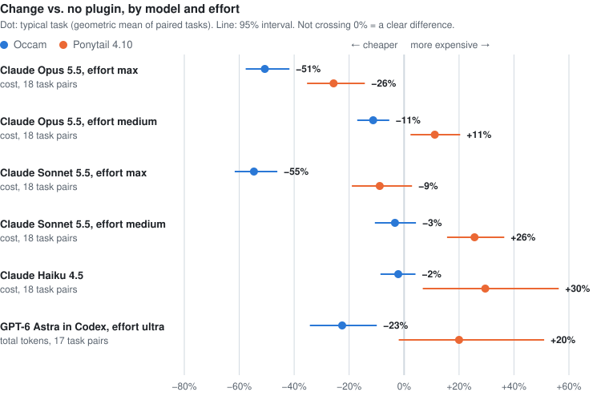

# Occam

[English](README.md) · [Videovergleich](#schwarzes-loch-benchmark-sol-61-max) · [Installation](#installation) · [Selbst messen](bench/black-hole/README.md)

**Weniger bauen. Schlank arbeiten. Knapp reden.**

Occam ist ein Regelwerk von 30 Zeilen für Coding-Agenten: vorhandenen Code und Standardwerkzeuge bevorzugen, gezielt lesen und die Ausgabe knapp halten. Es ist als Claude-Code-Plugin verfügbar; die Regeln werden auch in Codex getestet.

**Sol 6.1 max, Fast: 8,3 % weniger Gesamttokens mit Occam bei der Schwarzes-Loch-Aufgabe.** Alle drei Animationen bestehen die Browserprüfungen. In den separaten Claude-Programmierbenchmarks sanken die Kosten pro Aufgabe um **51 % auf Opus 5.5 max** und **55 % auf Sonnet 5.5 max**, bei mindestens ebenso vielen bestandenen Tests.

## Schwarzes-Loch-Benchmark: Sol 6.1 max

Ein Prompt, drei frische Docker-Container. Jede Variante erstellt eine einzelne offlinefähige HTML-Animation mit schwarzem Schatten, leuchtender Akkretionsscheibe, gebogenem Licht oberhalb und unterhalb, sichtbarer Bewegung sowie Pause/Fortsetzen/Neustart. Modell: **`gpt-6.1-sol`**, Reasoning **`max`**, **Fast ausdrücklich für alle Varianten angefordert**.

**Base → Occam → Ponytail 4.10**, von links nach rechts. Zehn Sekunden mit 30 Bildern/s, derselbe Browser, dieselbe Auflösung, Software-Grafik und Animationsuhr.

[](assets/black-hole/sol61-max-fast.mp4)

[Originalvideo abspielen/herunterladen](assets/black-hole/sol61-max-fast.mp4) · [Standbild bei fünf Sekunden](assets/black-hole/sol61-max-fast.png)

Im Standbild zieht Occams Scheibe einen weiten Bogen über den Schatten und zeigt darunter ein gebogenes Lichtband. Das Video zeigt Form, Struktur und Bewegung aller drei Ergebnisse nebeneinander.

<picture>
  <source media="(prefers-color-scheme: dark)" srcset="assets/black-hole/sol61-max-fast-tokens-dark.svg">
  
</picture>

| Variante | Gesamttokens | Gegenüber Base | Erzeugungszeit | Browserprüfungen |
|---|--:|--:|--:|:--|
| Base | 1.024.912 | — | 11,56 min | Bestanden |
| **Occam full** | 939.959 | −8,3 % | 8,82 min | Bestanden |
| Ponytail 4.10 full | 962.972 | −6,0 % | 8,29 min | Bestanden |

Occam benötigt **84.953 Tokens weniger als Base** und **2,4 % weniger als Ponytail**. [Original-HTML-Dateien und vollständige Messwerte](bench/black-hole/data/sol61-max-fast/RESULTS.md) · [Prompt, Bewertung und Anleitung](bench/black-hole/README.md).

**Einordnung:** ein Versuch je Variante bei einer visuellen Aufgabe, ohne Konfidenzintervall. Gesamttokens sind Input + Output; Cache und Reasoning sind jeweils einmal enthalten. Gemessen werden Tokens, kein Dollarpreis. Fast ist in Aufruf und Modellkatalog bestätigt; die CLI nennt die tatsächlich vom Server bediente Stufe nicht. Die Optik lässt sich im Video vergleichen; eine unabhängige visuelle Bewertung steht noch aus.

## Claude-Programmierbenchmarks

Fünf Runden, drei Modelle, jeweils 18 Aufgaben pro Variante. Claude lädt die tatsächlichen Plugins; versteckte Tests prüfen den entstandenen Code. Kostenänderungen sind geometrische Mittel der paarweise verglichenen Aufgaben.

| Modell | Effort | Occam gegenüber ohne Plugin | Ponytail gegenüber ohne Plugin | Tests bestanden / 18<br>Base · Occam · Ponytail |
|---|---|--:|--:|:--:|
| Opus 5.5 | max | **−51 %** | −26 % | 16 · **18** · 18 |
| Sonnet 5.5 | max | **−55 %** | −9 % ¹ | 16 · **17** · 17 |
| Opus 5.5 | medium | **−11 %** | +11 % | 17 · **18** · 18 |
| Sonnet 5.5 | medium | −3 % ¹ | +26 % | 16 · **18** · 18 |
| Haiku 4.5 | — | −2 % ¹ | +30 % | 10 · **13** · 10 |

¹ Das 95-%-Konfidenzintervall schließt null ein. Kleine Unterschiede sind keine gesicherte Ersparnis. Kosten sind hier die von Claude Code gemeldeten Listenpreis-Schätzungen einschließlich Thinking und Cache. Diese Aufgaben unterscheiden sich vom visuellen Codex-Pilot.

<details>
<summary>Kostengrafik, Methodik, Konfidenzintervalle und Rohdaten</summary>

<picture>
  <source media="(prefers-color-scheme: dark)" srcset="assets/change-by-model-dark.svg">
  
</picture>

[Ausführliche Ergebnisse und alle Rohdaten](bench/CLAUDE_RESULTS.de.md). Die neun Aufgaben umfassen Ursachenanalyse, eine Codefrage, eine CLI-Funktion, CSV-Auswertung, Testdaten, eine prozedurale Textur, Schutz vor Pfadmanipulation, Refactoring und einen gezielten Eingriff in eine große Datei. Alle Varianten erhalten dieselben erzeugten Dateien in getrennten Arbeitsumgebungen. Referenzprüfungen der Verifier und zusätzliche Opus-Aufgaben stehen im Bericht.

Grafik ohne Modellaufrufe neu erzeugen:

```shell
python bench/chart.py assets
```

</details>

## Installation

In Claude Code:

```text
/plugin marketplace add quisbaum-prog/occam
/plugin install occam@occam
```

Ist Ponytail bereits installiert, zuerst mit `/plugin uninstall ponytail@ponytail` entfernen, damit nicht beide Regelwerke in derselben Session landen. Lokal ausprobieren: `claude --plugin-dir ./plugin`.

Das Plugin nutzt POSIX-`sh`-Hooks. `SessionStart` liefert die vollständigen Regeln, `SubagentStart` eine Kurzfassung. Dafür werden weder Node noch Python benötigt. Der [Codex-Benchmark](bench/black-hole/README.md) übergibt den eingefrorenen vollständigen Regeltext als Entwickleranweisung.

Für normalen Chat gibt es [preferences.txt](app/preferences.txt) für die persönlichen Präferenzen und [den Chat-Skill](app/occam/) zur Nutzung auf Abruf.

## Bedienung

| Befehl | Wirkung |
|---|---|
| `/occam:occam full` | Alle Regeln; Standard |
| `/occam:occam lite` | Schlank arbeiten und knapp reden; normal bauen |
| `/occam:occam off` | Occam für diese Session abschalten |
| `/occam:audit 7` | Claude-Code-Tokenverbrauch der letzten sieben Tage auswerten |

Standard für neue Claude-Sessions in `~/.claude/settings.json`: `"env": {"OCCAM_LEVEL": "lite"}` (`full`, `lite` oder `off`). Das Audit läuft auch direkt: `python plugin/tools/audit.py --days 30`. Es liest lokale Claude-Transkripte und zeigt Tokenkosten, wiederholt gelesenen Kontext und große Tool-Ausgaben.

## Die Regeln

Das vollständige Regelwerk steht in [rules.md](plugin/skills/occam/rules.md).

- **Weniger bauen:** Bestehendes, Standardwerkzeuge und minimalen Code bevorzugen; Wiederholtes erzeugen; gemeinsame Ursachen beheben.
- **Schlank arbeiten:** erst suchen, dann lesen; unabhängige Aufrufe bündeln; Ausgaben klein halten; Änderungen prüfen.
- **Knapp reden:** nützliche Ergebnisse ohne routinemäßige Begleitberichte.
- **Nie kürzen:** Verständnis, Sicherheit, Barrierefreiheit, Validierung, Schutz vor Datenverlust und ausdrücklich Gewünschtes.

Die Benchmarks belegen Ersparnisse bei diesen Aufgaben. Sie belegen keine Verbesserung bei jedem Modell, Projekt, langen Gespräch oder visuellen Ergebnis. Das Audit und wiederholte Tests helfen, die eigene Arbeit zu messen.

## Den visuellen Benchmark wiederholen

Mit laufendem Docker und Codex-Anmeldung:

```shell
cd bench/black-hole
python bench.py build
python bench.py run --model gpt-6.1-sol --effort max --service-tier fast --repetitions 1
```

Das startet drei unabhängige Modellläufe. `--dry-run` zeigt den Plan; `--repetitions 3` startet neun Läufe. [Vollständige Anleitung und Bewertung](bench/black-hole/README.md).

## Credits und Unterstützung

[Ponytail](https://github.com/DietrichGebert/ponytail) von Dietrich Gebert hat die Regel-Injektion und den Vorrang vorhandener Werkzeuge inspiriert. Der Vergleich enthält seine eingefrorenen 4.10-Regeln.

Occam ist unter der [MIT-Lizenz](LICENSE) kostenlos. [Projekt sponsern](https://github.com/sponsors/quisbaum-prog), um weitere Benchmark-Läufe zu unterstützen.
