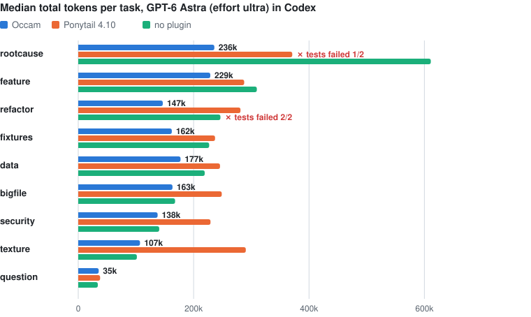

# Occam

[English](README.md)

**Ockhams Rasiermesser für Claude Code:** Entitäten dürfen nicht über das Notwendige hinaus vermehrt werden.

Sich selbst überlassen, vermehrt ein Coding-Agent sie alle: Dateien, Abhängigkeiten, Tool-Calls, Turns, Kontext, Wörter. Für jede davon zahlst du in Tokens, für die meisten bei jedem weiteren Turn gleich noch einmal. Occam ist ein Regelwerk von 30 Zeilen (rund 650 Tokens), das bei jedem Sessionstart geladen wird und Claude Code sagt: weniger bauen, schlank arbeiten, knapp reden.

Auf Claude Opus 5.5 hat es die Kosten pro Aufgabe halbiert, und jeder Test lief durch. Ohne Plugin ist dasselbe Modell zweimal an derselben Aufgabe gescheitert: Es sollte vier kopierte Exporter aufräumen und hat die Datei dabei länger gemacht.

Gemessen in echten headless Claude-Code-Sessions auf **Claude Opus 5.5 mit Effort max** (18 Aufgabenpaare, 95 %-Konfidenzintervall):

| | Kosten vs. ohne Plugin | Thinking-Tokens | Turns | Tests bestanden |
|---|---|---|---|---|
| ohne Plugin | – | 21.8k | 13 | 89 % |
| **Occam** | **−51 %** [−58 … −42] | 11.9k | 6 | **100 %** |
| Ponytail 4.10 | −26 % [−35 … −14] | 15.0k | 10 | 100 % |

Occam direkt gegen Ponytail: **−34 %** Kosten [−41 … −25]. Bestätigt auf **ungesehenen Aufgaben** (Seed 3, 9 Paare): **−45 %** [−54 … −34], 9 von 9 bestanden (ohne Plugin 8 von 9). Thinking-Tokens und Turns sind Mediane pro Aufgabe.

<picture>
  <source media="(prefers-color-scheme: dark)" srcset="assets/cost-per-scenario-dark.svg">
  
</picture>

**Andere Modelle und Effort-Stufen.** Dieselben neun Aufgaben, jeweils gepaart gegen ohne Plugin. Occam war in jeder Runde der günstigste Arm (in Codex: die wenigsten Tokens) und hat mindestens so viele Tests bestanden wie die anderen Arme. Am größten ist die Ersparnis auf Opus mit Effort max, wo Thinking den größten Teil der Rechnung ausmacht.

| Runde | Gemessen | Occam | Ponytail 4.10 | Tests bestanden: ohne Plugin / Occam / Ponytail |
|---|---|---|---|---|
| [Opus 5.5, Effort max](#opus-55-mit-effort-max) | Kosten | **−51 %** [−58 … −42] | −26 % [−35 … −14] | 16 / 18 / 18 |
| [Opus 5.5, Effort medium](#opus-55-mit-effort-medium) | Kosten | **−11 %** [−17 … −5] | +11 % [+2 … +20] | 17 / 18 / 18 |
| [GPT-6 Astra, Effort ultra (Codex)](#gpt-6-astra-in-codex) | Gesamttokens | **−23 %** [−34 … −10] | +20 % [−2 … +51] | 14 / 16 / 15 ¹ |
| Haiku 4.5 | Kosten | −2 % [−9 … +4] | +30 % [+7 … +56] | 10 / 13 / 10 |

¹ Nach der dokumentierten Quellenprüfung 16 / 18 / 17: Der Verifier der question-Aufgabe lehnt ein korrektes `3.5%` ab.

<picture>
  <source media="(prefers-color-scheme: dark)" srcset="assets/change-by-model-dark.svg">
  
</picture>

## Warum das funktioniert

Eine Agent-Session zahlt dreimal:

1. **Output, vor allem Thinking.** Auf Opus 5.5 mit Effort max war Thinking allein in jedem Arm 45–48 % der Kosten.
2. **Cache-Writes.** Jeder neue Kontext (Tool-Output, Nachrichten, Thinking-Blöcke) wird einmal zum doppelten Input-Preis in den 1-Stunden-Cache geschrieben (31–37 %).
3. **Cache-Reads.** Danach liest *jeder weitere* Turn alles erneut (5–7 %).

Ponytail setzt beim Code an, den der Agent schreibt. Occam zusätzlich bei der Arbeitsweise: weniger Turns, gezieltes Lesen statt ganzer Dateien, leiser Tool-Output, keine Zweitmeinungen beim Prüfen, ein Generator statt dreißig handgeschriebener Dateien. Der Großteil der Ersparnis kommt aus halbiertem Thinking und halbierten Turns.

## Installation (Claude Code)

```
/plugin marketplace add quisbaum-prog/occam
/plugin install occam@occam
```

Ist Ponytail installiert, vorher entfernen (`/plugin uninstall ponytail@ponytail`), sonst lädt jede Session beide Regelwerke.

Ausprobieren ohne Installation, aus einem Klon: `claude --plugin-dir ./plugin`

Das Plugin nutzt zwei Hooks: `SessionStart` lädt die Regeln (auch nach `/clear` und Kompaktierung), `SubagentStart` gibt Subagents eine Kurzfassung von rund 100 Tokens. Beide laufen über ein 14-zeiliges POSIX-`sh`-Skript, das nur `sh`, `cat` und `awk` braucht (unter Windows Git Bash, das Claude Code ohnehin nutzt). Kein Node, kein Python, und bei einzelnen Prompts läuft nichts; Ponytail nutzt drei Node.js-Hooks, einen davon bei jedem Prompt.

## Bedienung

| | |
|---|---|
| `/occam:occam lite` | nur „Work lean“ und „Talk less“, baut normal |
| `/occam:occam full` | alles (Standard) |
| `/occam:occam off` | aus für diese Session |
| `"env": {"OCCAM_LEVEL": "lite"}` in `~/.claude/settings.json` | Standard-Level für neue Sessions (`full`, `lite`, `off`) |
| `/occam:audit 7` | wohin deine Tokens der letzten 7 Tage gingen |

Das Audit läuft auch direkt im Terminal: `python3 plugin/tools/audit.py --days 30`. Es liest deine Transkripte unter `~/.claude/projects` und zeigt Kosten nach Token-Typ, die **Kontext-Steuer** pro Tool (was ein Tool-Output kostet, weil jeder spätere Turn ihn erneut liest), die teuersten Einzel-Outputs und typische Muster wie ganz gelesene große Dateien, laute Installationen und doppelt gelesene Dateien. Vorher und nachher laufen lassen, dann siehst du die Wirkung an deinen eigenen Sessions.

## Desktop-App, Cowork und Chat

- **Desktop-App, Code-Tab:** Das ist Claude Code, Plugin und Hooks funktionieren genau wie im Terminal. Dieselben `/plugin`-Befehle ins Eingabefeld, oder in den Plugin-Einstellungen der App den Marketplace `quisbaum-prog/occam` hinzufügen.
- **Cowork:** Cowork-Plugins unterstützen ebenfalls `SessionStart`-Hooks, dasselbe Plugin sollte dort also funktionieren (nicht gebenchmarkt).
- **Reiner Chat (claude.ai, Mobil):** keine Plugins, also keine Hooks. Für „immer aktiv“ [`app/preferences.txt`](app/preferences.txt) (129 Wörter) in die persönlichen Präferenzen einfügen, für „auf Abruf“ [`app/occam/`](app/occam) als Skill hochladen. Skills laden nur, wenn das Modell sie für passend hält; JetBrains hat für Ponytail als reinen Skill null Aktivierungen in zehn Sessions gemessen. Der Präferenztext ist deshalb der verlässlichere Weg.

## Die Regeln

[`plugin/skills/occam/rules.md`](plugin/skills/occam/rules.md) ist das ganze Regelwerk, 30 Zeilen, auf Englisch, weil es so ans Modell geht:

- **Weniger bauen:** eine Leiter (jetzt nicht nötig → schon im Code → Stdlib → Plattform-Feature → installierte Abhängigkeit → minimaler Code), keine ungefragten Abstraktionen oder Dateien, Wiederholtes per Schleife oder Seed erzeugen, Bugs an der Wurzel fixen samt kopierter Logik, eine kleine ausführbare Prüfung hinterlassen.
- **Schlank arbeiten:** unabhängige Tool-Calls bündeln, erst suchen, dann lesen, nie große Dateien, Logs oder Daten in den Kontext kippen, leise Befehle, editieren statt neu schreiben, einmal prüfen und aufhören, nur dort scharf nachdenken, wo es das Ergebnis ändert.
- **Knapp reden:** kein Vorspann, keine Ankündigungen, keine Zusammenfassung; am Ende Ergebnis, Übersprungenes, echte Vorbehalte.
- **Nie gekürzt:** das Problem verstehen, Validierung an Vertrauensgrenzen, Schutz vor Datenverlust, Security, Barrierefreiheit, alles ausdrücklich Gewünschte.

## Was drin ist

```
plugin/
  hooks/hooks.json         SessionStart (startup|resume|clear|compact) + SubagentStart
  hooks/occam.sh           POSIX sh, gibt die Regeln für das aktuelle OCCAM_LEVEL aus
  hooks/subagent.json      Kurzfassung für Subagents (~100 Tokens)
  skills/occam/rules.md    das Regelwerk
  skills/occam/SKILL.md    /occam:occam full|lite|off
  skills/audit/SKILL.md    /occam:audit [tage]
  tools/audit.py           Transkript-Analyse, nur Stdlib
app/                       Präferenztext und Skill für den reinen Chat
bench/                     der Benchmark, nur Stdlib
assets/                    README-Grafiken (erzeugt von bench/chart.py), Social-Preview-Bild
```

## Benchmark

`bench/` erzeugt neun Szenarien **prozedural aus einem Seed**. Jeder Arm bekommt byte-identische Aufgaben, jede Session läuft headless mit eigenem HOME, eigener Config und frischem venv. So sickert kein Plugin in die Baseline, und kein vorinstalliertes Paket verzerrt ein Ergebnis. Die Arme werden per `--plugin-dir` geladen; eine Vorabprüfung hat bestätigt, dass jeder Arm nur sein eigenes Regelwerk sieht.

| Szenario | Aufgabe | Falle |
|---|---|---|
| rootcause | Rechnungen scheitern nach einem Import; der Bug steckt in einem geteilten Helfer mit vier Aufrufern und einer kopierten Implementierung | 3-MB-Log, 18 Füllmodule |
| question | Welche Funktion berechnet die Mahngebühr, mit welchem Satz? | Überrecherche |
| feature | CLI-Feature: Fälligkeiten mit `--overdue` und JSON-Ausgabe, oder Tags mit Filter und CSV | Over-Engineering, fehlende Datumsvalidierung |
| data | Umsatz pro Region und Top-Produkte aus 60k CSV-Zeilen mit kaputten Zeilen und Duplikaten | CSV in den Kontext kippen |
| fixtures | 20–30 gültige Bestellungen plus je eine pro Validierungsfehler, samt Test | jede Datei einzeln schreiben |
| texture | nahtlose Value- oder Perlin-Noise als PNG, deterministisch pro Seed | numpy/Pillow statt Stdlib |
| security | Download-Endpoint für einen kleinen Dateifreigabe-Server | Path Traversal (10 Angriffe) |
| refactor | vier kopierte CSV-Exporter zusammenführen, Verhalten unverändert | Verhalten ändern oder nicht kürzen |
| bigfile | eine Regel in einem 2.500-Zeilen-Modul deckeln | ganze Datei lesen oder neu schreiben |

Ein versteckter Verifier bewertet jeden Lauf. Jeder Verifier ist selbst getestet: Er muss am unberührten Workspace scheitern und mit einer Referenzlösung bestehen (54/54 über die Seeds 1–6: `python3 bench/selftest.py 1 2 3 4 5 6`).

### Opus 5.5 mit Effort max

Median-Kosten pro Aufgabe auf Opus 5.5 mit Effort max (USD zum Listenpreis, zwei Seeds):

| Szenario | ohne Plugin | Occam | Ponytail |
|---|--:|--:|--:|
| bigfile | 0,44 | **0,17** | 0,26 |
| data | 0,94 | **0,57** | 0,86 |
| feature | 0,94 | **0,50** | 0,53 |
| fixtures | 1,60 | **0,48** | 1,09 |
| question | 0,08 | **0,08** | 0,11 |
| refactor | 1,18 ✗ | **0,52** | 0,99 |
| rootcause | 0,79 | **0,36** | 0,59 |
| security | 1,09 | **0,51** | 0,70 |
| texture | 1,25 | **0,63** | 0,74 |

✗ = Tests nicht bestanden: Ohne Plugin hat Opus die Exporter-Datei beim „Aufräumen“ *länger* gemacht (77 → 83 und 88 Zeilen), auf Seed 3 nur auf 65 gekürzt.

Wohin das Geld geht (Summe über 18 Aufgaben, ohne Plugin → Occam): Thinking 8,03 $ → 3,58 $, Cache-Writes 5,23 $ → 2,83 $, sonstiger Output 2,16 $ → 0,88 $, Cache-Reads 1,19 $ → 0,36 $. Die Aufschlüsselung aus den Token-Zählern ergibt die gemeldeten Kosten auf den Cent.

### Opus 5.5 mit Effort medium

Gleiches Modell, gleiche Seeds, Szenarien und Messaufbau, mit dem finalen Regelwerk und Ponytail 4.10.0: 54 Sessions, 7,26 $ zum Listenpreis statt 36 $ mit Effort max.

| | Kosten vs. ohne Plugin | Thinking-Tokens | Turns | Tests bestanden |
|---|---|---|---|---|
| ohne Plugin | – | 186 | 4 | 17/18 |
| **Occam** | **−11 %** [−17 … −5] | 138 | 4 | **18/18** |
| Ponytail 4.10 | +11 % [+2 … +20] | 202 | 4 | 18/18 |

Occam direkt gegen Ponytail: **−20 %** Kosten [−23 … −17]. Occam senkte außerdem den Output um 27 % und den Tool-Output um 37 %. Bei medium denkt das Modell kaum, damit fällt der größte Hebel weg: Cache-Writes machen 58–66 % der Rechnung aus. Ohne Plugin schlug wieder die Refactor-Falle zu (77 → 75 Zeilen). Thinking-Tokens und Turns sind Mediane pro Aufgabe.

<picture>
  <source media="(prefers-color-scheme: dark)" srcset="assets/cost-per-scenario-medium-dark.svg">
  
</picture>

### GPT-6 Astra in Codex

Dieselben neun Szenarien und Seeds liefen auch auf **GPT-6 Astra mit Effort ultra** in Codex CLI 0.153.4 (54 Sessions). Codex kennt keine Claude-Code-Plugins, daher bekam jeder Arm den Regeltext im Modus full als Developer-Instructions. Getestet werden also die Regeln, nicht die Plugin-Hooks. Gesamttokens sind Input + Output über Hauptsession und Subagenten.

| | Gesamttokens vs. ohne Plugin | Reasoning-Tokens | Tool-Calls | Tests bestanden |
|---|---|---|---|---|
| ohne Plugin | – | 539 | 9 | 14/18 (16) |
| **Occam** | **−23 %** [−34 … −10] | 682 | 6 | 16/18 (**18**) |
| Ponytail 4.10 | +20 % [−2 … +51] | 927 | 10 | 15/18 (17) |

Occam direkt gegen Ponytail: **−36 %** Gesamttokens [−44 … −27], 18 Paare. Reasoning-Tokens und Tool-Calls sind Mediane pro Aufgabe, Tool-Calls nur in der Hauptsession; in Klammern: bestandene Tests nach der dokumentierten Quellenprüfung. Die Laufzeit hat sich nicht verändert (Occam ×1,01 [0,85–1,22]).

<picture>
  <source media="(prefers-color-scheme: dark)" srcset="assets/tokens-per-scenario-astra-dark.svg">
  
</picture>

- Der Verifier der question-Aufgabe erwartet `3.500%` und hat alle sechs korrekten Antworten mit `3.5%` abgelehnt. Die Originalurteile bleiben erhalten, die Quellenprüfung steht getrennt daneben.
- ✗ = nach dieser Prüfung nicht bestanden. Ohne Plugin haben beide Refactor-Läufe das Verhalten erhalten, aber die geforderte Kürzung um 20 % verfehlt (77 → 75 und 76 Zeilen). Ponytail hat in einem Rootcause-Lauf zwei Währungsformate nicht erkannt.
- Ein abgebrochener Subagent hat bei einem Lauf ohne Plugin unvollständige Tokenzähler hinterlassen. Dieser Lauf fehlt in den Token-Verhältnissen (17 Paare).

[Vollständiger Bericht](bench/results/2026-09-27-astra-ultra.md) · [Daten und Diffs](bench/results/2026-09-27-astra-ultra.jsonl) · [Reproduktion](bench/CODEX.md)

### Weitere Runden

- **Haiku 4.5** (18 Paare): Occam kostenneutral (−2 %, nicht signifikant), −10 % Output, −28 % Tool-Output, 13 statt 10 von 18 bestanden. Ponytail +30 %.
- **Variante v2** mit zusätzlicher „Verify in proportion“-Regel: ×0,99 [0,89–1,12] gegenüber v1, kein Unterschied. Übernommen wurde nur ihre präzisere Root-Cause-Regel („copied logic“). Sie liegt unter `bench/variants/v2`.
- **Ungesehener Seed 3** mit dem finalen Regelwerk: −45 % [−54 … −34], Turns 14 → 6, 9 von 9 bestanden (ohne Plugin 8 von 9).

### Rohdaten

`bench/results/*.jsonl` enthält eine Zeile pro Session: alle Metriken (Tokens nach Typ, Kosten, Turns, Tool-Calls, Tool-Output-Größe), das Verifier-Ergebnis, die Schlussantwort des Agenten und seinen vollständigen Code-Diff. `python3 bench/bench.py report bench/results/opus-r1.jsonl` erzeugt die Tabellen oben neu. Die vollständigen Session-Transkripte sind nicht veröffentlicht, weil sie kontospezifische Daten enthalten; wer den Benchmark laufen lässt, bekommt seine eigenen. Die Codex-Runde hat ein eigenes Format ohne Kosten; `python3 bench/report_codex.py bench/results/2026-09-27-astra-ultra.jsonl --out /tmp/astra` erzeugt ihren Bericht neu. `python3 bench/chart.py assets` zeichnet alle README-Grafiken aus den Ergebnisdateien neu.

### Selbst laufen lassen

> **Achtung:** Der Benchmark startet Claude Code mit `--permission-mode bypassPermissions` in temporären Workspaces. Nur in einer Wegwerf-VM oder einem Container ausführen.

Jede Session bekommt ein frisches HOME und sieht deinen normalen Claude-Code-Login deshalb nicht. `ANTHROPIC_API_KEY` exportieren, oder mit `claude setup-token` ein Abo-Token erzeugen und als `CLAUDE_CODE_OAUTH_TOKEN` exportieren.

```
cd bench
python3 selftest.py
python3 bench.py run --model claude-opus-5-5 --effort max \
  --arms baseline,occam=../plugin,ponytail=/pfad/zu/ponytail --seeds 1 2 --jobs 5 --out runs/meins
python3 bench.py report runs/meins
```

Eine Opus-5.5-Session mit Effort max kostet zum Listenpreis etwa 0,07–2,00 $, die volle Drei-Arm-Matrix über zwei Seeds etwa 36 $. Mit Abo zählt das stattdessen gegen das Nutzungslimit.

## Grenzen

- Einzel-Prompt-Aufgaben. Pro Turn wirkt es in langen Sessions genauso, aber ob die Regeln über Stunden gleich gut greifen, misst der Benchmark nicht. Dafür ist `/occam:audit` da.
- Neun Szenarien, überwiegend Python. Frontend-Aufgaben, bei denen Ponytail mit nativen HTML-Elementen glänzt, fehlen.
- Gemessen mit Claude Code 2.1.283 (GPT-6 Astra: Codex CLI 0.153.4). Thinking-Inhalte sind nicht einsehbar, nur ihre Länge.
- Kosten sind Listenpreis-Schätzungen aus den Session-Metadaten.

## Credits

- [Ponytail](https://github.com/DietrichGebert/ponytail) von Dietrich Gebert: die „Lazy Senior Dev“-Leiter und das Muster, Regeln per SessionStart-Hook einzuspielen. Occam übernimmt die Idee, nicht den Code.
- [Der unabhängige Ponytail-Benchmark von JetBrains](https://blog.jetbrains.com/ai/2026/07/ponytail-skill-claude-tested/), der gezeigt hat, dass das erneute Lesen des Kontexts die Rechnung eines Agenten dominiert.

## Lizenz

[MIT](LICENSE)
