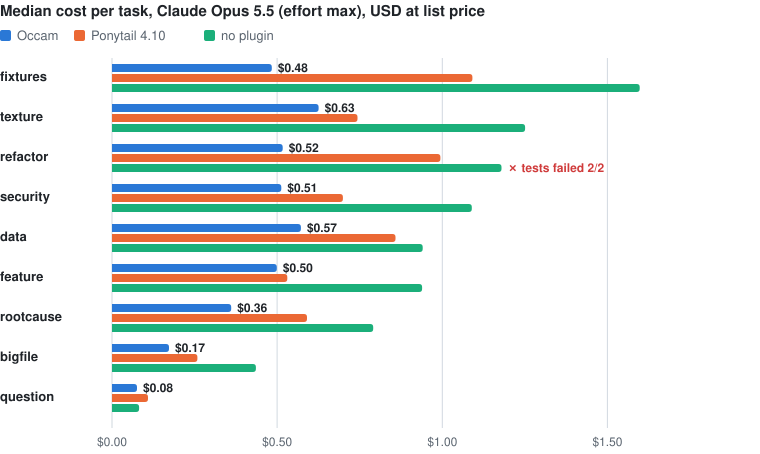

# Occam

**Token economy for Claude Code.** A ~650-token rule set that loads at every session start: build less, work lean, talk less. Standard library before dependencies, generate instead of enumerate, verify once and stop.

[Deutsch](README.de.md)

Measured in real headless Claude Code sessions on **Claude Opus 5.5 at effort max** (18 task pairs, 95% confidence interval):

| | Cost vs. no plugin | Thinking tokens | Turns | Tests passed |
|---|---|---|---|---|
| no plugin | – | 21.8k | 13 | 89% |
| **Occam** | **−51%** [−58 … −42] | 11.9k | 6 | **100%** |
| Ponytail 4.10 | −26% [−35 … −14] | 15.0k | 10 | 100% |

Occam vs. Ponytail directly: **−34%** cost [−41 … −25]. Confirmed on **held-out tasks** (seed 3, 9 pairs): **−45%** [−54 … −34], 9/9 passed (no plugin: 8/9). Thinking tokens and turns are medians per task.

<picture>
  <source media="(prefers-color-scheme: dark)" srcset="assets/cost-per-scenario-dark.svg">
  
</picture>

## Why it works

An agent session pays three times:

1. **Output, mostly thinking.** On Opus 5.5 at effort max, thinking was about 47% of the bill in every arm.
2. **Cache writes.** Every new piece of context (tool output, messages, thinking blocks) is written once to the 1-hour prompt cache at twice the input price (35–42%).
3. **Cache reads.** After that, *every later turn* reads all of it again (6–8%).

Ponytail targets the code the agent writes. Occam also targets how the agent works: fewer turns, targeted reads instead of whole files, quiet tool output, no second opinions during verification, one generator instead of thirty hand-written files. Most of the savings come from halving thinking and halving turns.

## Install (Claude Code)

```
/plugin marketplace add quisbaum-prog/occam
/plugin install occam@occam
```

If Ponytail is installed, remove it first (`/plugin uninstall ponytail@ponytail`). Otherwise every session loads both rule sets.

To try it without installing, from a clone: `claude --plugin-dir ./plugin`

Needs only `sh`, `cat` and `awk` (Git Bash on Windows, which Claude Code uses anyway). No Node or Python for the hooks.

## Use

| | |
|---|---|
| `/occam:occam lite` | only "Work lean" and "Talk less", builds as usual |
| `/occam:occam full` | everything (default) |
| `/occam:occam off` | off for this session |
| `"env": {"OCCAM_LEVEL": "lite"}` in `~/.claude/settings.json` | default level for new sessions (`full`, `lite`, `off`) |
| `/occam:audit 7` | where your tokens went in the last 7 days |

The audit also runs straight from a terminal: `python3 plugin/tools/audit.py --days 30`. It reads your transcripts under `~/.claude/projects` and shows cost by token type, the **context tax** per tool (what a tool output costs because every later turn re-reads it), the most expensive single outputs, and common patterns such as whole large files read, noisy installs and files read twice. Run it before and after installing to see the effect on your own sessions.

## In the Claude app (claude.ai, desktop)

There are no hooks there. Two options:

- **Always on:** paste [`app/preferences.txt`](app/preferences.txt) (129 words) into your personal preferences.
- **On demand:** upload [`app/occam/`](app/occam) as a skill. Skills only load when the model decides they fit; JetBrains measured zero activations in ten sessions for Ponytail as a plain skill, so the preferences text is the reliable route.

## The rules

[`plugin/skills/occam/rules.md`](plugin/skills/occam/rules.md) is the whole thing, 30 lines:

- **Build less:** a ladder (not needed now → already in the codebase → stdlib → native platform feature → installed dependency → minimum code), no unrequested abstractions or files, generate repeated structure with a loop or seeded generator, fix bugs at the root including copied logic, leave one small runnable check.
- **Work lean:** batch independent tool calls, locate before reading, never dump large files, logs or data, quiet command output, edit instead of rewrite, verify once and stop, think hard only where it changes the outcome.
- **Talk less:** no preamble, no narration, no recap; end with the result, what was skipped, real caveats.
- **Never cut:** understanding the problem, validation at trust boundaries, data-loss handling, security, accessibility, anything explicitly requested.

## What's inside

```
plugin/
  hooks/hooks.json         SessionStart (startup|resume|clear|compact) + SubagentStart
  hooks/occam.sh           POSIX sh, prints the rules for the current OCCAM_LEVEL
  hooks/subagent.json      short version for subagents (~100 tokens)
  skills/occam/rules.md    the rules
  skills/occam/SKILL.md    /occam:occam full|lite|off
  skills/audit/SKILL.md    /occam:audit [days]
  tools/audit.py           transcript audit, stdlib only
app/                       preferences text and skill for the Claude app
bench/                     the benchmark, stdlib only
assets/                    README chart, generated by bench/chart.py
```

## Benchmark

`bench/` generates nine scenarios **procedurally from a seed**. Every arm gets byte-identical tasks, and every session runs headless with its own HOME, its own config directory and a fresh virtualenv, so no plugin leaks into the baseline and no preinstalled package skews a result. Arms are loaded with `--plugin-dir`; a check confirmed that each arm sees only its own rules.

| Scenario | Task | Trap |
|---|---|---|
| rootcause | invoices fail after an import; the bug sits in a shared helper with four callers and one copied implementation | 3 MB log, 18 filler modules |
| question | which function applies the late fee, at what rate? | over-research |
| feature | CLI feature: due dates with `--overdue` and JSON output, or tags with a filter and CSV | over-engineering, missing date validation |
| data | revenue by region and top products from 60k CSV rows with broken rows and duplicates | dumping the CSV into context |
| fixtures | 20–30 valid orders plus one per validation error code, with a test | writing each file by hand |
| texture | seamless value or Perlin noise as PNG, deterministic per seed | numpy/Pillow instead of stdlib |
| security | download endpoint for a small file-share server | path traversal (10 attacks) |
| refactor | merge four copy-pasted CSV exporters without changing behavior | changing behavior, or not shrinking |
| bigfile | cap one rule in a 2,500-line module | reading or rewriting the whole file |

A hidden verifier scores each run. Every verifier is tested itself: it must fail on the untouched workspace and pass with a reference solution (`python3 bench/selftest.py`, 54/54).

Median cost per task on Opus 5.5 at effort max (USD at list price, two seeds):

| Scenario | no plugin | Occam | Ponytail |
|---|--:|--:|--:|
| bigfile | 0.44 | **0.17** | 0.26 |
| data | 0.94 | **0.57** | 0.86 |
| feature | 0.94 | **0.50** | 0.53 |
| fixtures | 1.60 | **0.48** | 1.09 |
| question | 0.08 | **0.08** | 0.11 |
| refactor | 1.18 ✗ | **0.52** | 0.99 |
| rootcause | 0.79 | **0.36** | 0.59 |
| security | 1.09 | **0.51** | 0.70 |
| texture | 1.25 | **0.63** | 0.74 |

✗ = tests failed: without a plugin, Opus made the exporter file *longer* while "cleaning it up" (77 → 83 and 88 lines), and on seed 3 shrank it only to 65.

Where the money goes (sum over 18 tasks, no plugin → Occam): thinking $8.03 → $3.58, cache writes $5.23 → $2.83, other output $2.16 → $0.88, cache reads $1.19 → $0.36. The breakdown from token counts reproduces the reported costs to the cent.

Other rounds:

- **Haiku 4.5** (18 pairs): Occam cost-neutral (−2%, not significant), −10% output, −28% tool output, 13 instead of 10 of 18 passed. Ponytail +30%.
- **Variant v2** with an extra "verify in proportion" rule: ×0.99 [0.89–1.12] vs. v1, no difference. Only its sharper root-cause rule ("copied logic") was kept. It lives in `bench/variants/v2`.
- **Held-out seed 3** with the final rules: −45% [−54 … −34], turns 14 → 6, 9/9 passed (no plugin: 8/9).

### Raw data

`bench/results/*.jsonl` holds one line per session: every metric (tokens by type, cost, turns, tool calls, tool output size), the verifier result, the agent's final answer and its full code diff. `python3 bench/bench.py report bench/results/opus-r1.jsonl` rebuilds the tables above. Full session transcripts are not published because they contain account-specific data; run the benchmark to get your own.

### Run it yourself

> **Warning:** the benchmark runs Claude Code with `--permission-mode bypassPermissions` inside temporary workspaces. Run it in a disposable VM or container.

Each session gets a fresh HOME, so your normal Claude Code login is not visible to it. Export `ANTHROPIC_API_KEY`, or create a subscription token with `claude setup-token` and export it as `CLAUDE_CODE_OAUTH_TOKEN`.

```
cd bench
python3 selftest.py
python3 bench.py run --model claude-opus-5-5 --effort max \
  --arms baseline,occam=../plugin,ponytail=/path/to/ponytail --seeds 1 2 --jobs 5 --out runs/mine
python3 bench.py report runs/mine
```

One Opus 5.5 session at effort max costs about $0.07–2.00 at list price; the full three-arm matrix on two seeds about $36. On a subscription this counts against your usage limits instead.

## Limits

- Single-prompt tasks. The effect per turn is the same in long sessions, but whether the rules hold up over hours of work is not measured here. That is what `/occam:audit` is for.
- Nine scenarios, mostly Python. Frontend tasks, where Ponytail shines with native HTML elements, are missing.
- Measured with Claude Code 2.1.283. Thinking content is not visible, only its length.
- Costs are list-price estimates from session metadata.

## Credits

- [Ponytail](https://github.com/DietrichGebert/ponytail) by Dietrich Gebert: the "lazy senior dev" ladder and the pattern of injecting rules through a SessionStart hook. Occam borrows the idea, not the code.
- [JetBrains' independent Ponytail benchmark](https://blog.jetbrains.com/ai/2026/07/ponytail-skill-claude-tested/), which showed that re-reading context dominates an agent's bill.

## License

[MIT](LICENSE)
