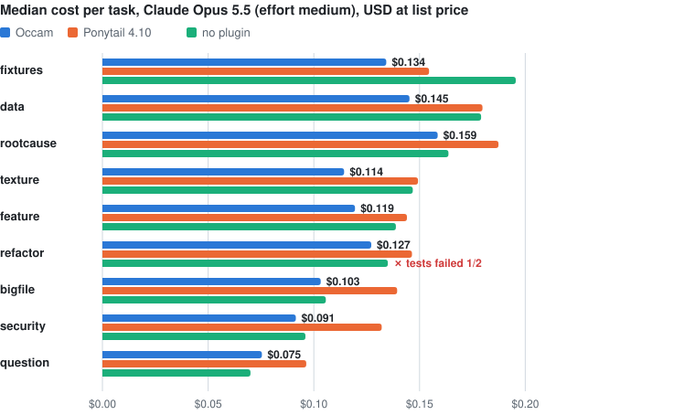
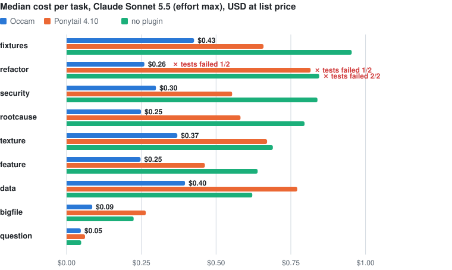
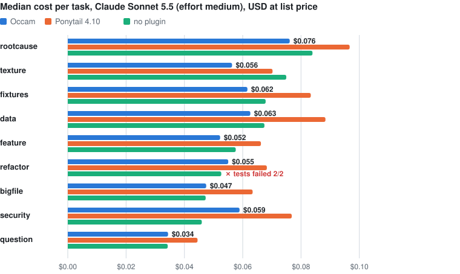
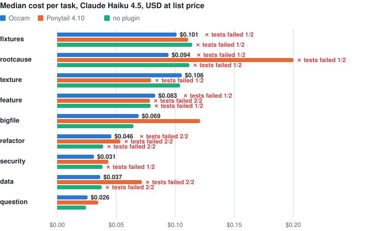

# Claude-Programmierbenchmarks

[Zurück zu Occam](../README.de.md) · [English](CLAUDE_RESULTS.md)

## Ergebnisse im Detail

### So wurde gemessen

`bench/` erzeugt neun Szenarien **prozedural aus einem Seed**. Jede Variante bekommt byte-identische Aufgaben, jede Session läuft headless mit eigenem HOME, eigener Config und frischem venv. So sickert kein Plugin in die Baseline, und kein vorinstalliertes Paket verzerrt ein Ergebnis. Die Plugins werden per `--plugin-dir` geladen; die Session-Logs bestätigen, dass jede Variante nur ihr eigenes Regelwerk sieht.

| Szenario | Aufgabe | Falle |
|---|---|---|
| rootcause | Rechnungen scheitern nach einem Import; der Bug steckt in einem geteilten Helfer mit vier Aufrufern und einer kopierten Implementierung | 3-MB-Log, 18 Füllmodule |
| question | Welche Funktion berechnet die Mahngebühr, mit welchem Satz? | Überrecherche |
| feature | CLI-Feature: Fälligkeiten mit `--overdue` und JSON-Ausgabe, oder Tags mit Filter und CSV | Over-Engineering, fehlende Datumsvalidierung |
| data | Umsatz pro Region und Top-Produkte aus 60k CSV-Zeilen mit kaputten Zeilen und Duplikaten | CSV in den Kontext kippen |
| fixtures | 20–30 gültige Bestellungen plus je eine pro Validierungsfehler, samt Test | jede Datei einzeln schreiben |
| texture | nahtlose Value- oder Perlin-Noise als PNG, deterministisch pro Seed | numpy/Pillow statt Stdlib |
| security | Download-Endpoint für einen kleinen Dateifreigabe-Server | Path Traversal (10 Angriffe) |
| refactor | vier kopierte CSV-Exporter zusammenführen, Verhalten unverändert | Verhalten ändern oder nicht kürzen |
| bigfile | eine Regel in einem 2.500-Zeilen-Modul deckeln | ganze Datei lesen oder neu schreiben |

Ein versteckter Verifier bewertet jeden Lauf. Jeder Verifier ist selbst getestet: Er muss am unberührten Workspace scheitern und mit einer Referenzlösung bestehen (54/54 über die Seeds 1–6: `python3 bench/selftest.py 1 2 3 4 5 6`).

Jede Runde lässt die neun Szenarien auf den Seeds 1 und 2 laufen, jede Variante löst also 18 Aufgaben. In den Tabellen unten:

- **Kosten vs. ohne Plugin:** für jede Aufgabe die Kosten mit Plugin geteilt durch die Kosten ohne; davon das geometrische Mittel über die 18 Paare, in Klammern das 95-%-Bootstrap-Konfidenzintervall.
- **Kosten** sind der Listenpreis, den Claude Code für die Session meldet, samt Thinking und Cache.
- **Thinking-Tokens** und **Turns** sind Mediane pro Aufgabe.

### Claude Opus 5.5, Effort max

54 Sessions, 36 $ zum Listenpreis.

| | Kosten vs. ohne Plugin | Thinking-Tokens | Turns | Tests bestanden |
|---|---|--:|--:|--:|
| ohne Plugin | – | 21,8k | 13 | 16/18 |
| **Occam** | **−51 %** [−58 … −42] | 11,9k | 6 | **18/18** |
| Ponytail 4.10 | −26 % [−35 … −14] | 15,0k | 10 | 18/18 |

- Occam direkt gegen Ponytail: **−34 %** [−41 … −25].
- Wohin das Geld geht (Summe über 18 Aufgaben, ohne Plugin → Occam): Thinking 8,03 $ → 3,58 $, Cache-Writes 5,23 $ → 2,83 $, sonstiger Output 2,16 $ → 0,88 $, Cache-Reads 1,19 $ → 0,36 $. Die Aufschlüsselung aus den Token-Zählern ergibt die gemeldeten Kosten auf den Cent.
- Ohne Plugin ist Opus zweimal an der Refactor-Aufgabe gescheitert: Es hat die Exporter-Datei beim „Aufräumen“ *länger* gemacht (77 → 83 und 88 Zeilen).
- Bestätigt auf **ungesehenen Aufgaben** (Seed 3, 9 Paare): −45 % [−54 … −34], Turns 14 → 6, 9 von 9 bestanden. Ohne Plugin 8 von 9: Der Refactor schrumpfte nur auf 65 Zeilen.

<details>
<summary>Kosten pro Aufgabe in allen neun Szenarien</summary>

<picture>
  <source media="(prefers-color-scheme: dark)" srcset="../assets/cost-per-scenario-dark.svg">
  
</picture>
</details>

### Claude Opus 5.5, Effort medium

54 Sessions, 7,26 $ zum Listenpreis.

| | Kosten vs. ohne Plugin | Thinking-Tokens | Turns | Tests bestanden |
|---|---|--:|--:|--:|
| ohne Plugin | – | 186 | 4 | 17/18 |
| **Occam** | **−11 %** [−17 … −5] | 138 | 4 | **18/18** |
| Ponytail 4.10 | +11 % [+2 … +20] | 202 | 4 | 18/18 |

- Occam direkt gegen Ponytail: **−20 %** [−23 … −17]. Occam senkte außerdem den Output um 27 % und den Tool-Output um 37 %.
- Bei medium denkt das Modell kaum, damit fällt der größte Hebel weg: Cache-Writes machen 58–66 % der Rechnung aus.
- Ohne Plugin schlug wieder die Refactor-Falle zu (77 → 75 Zeilen).

<details>
<summary>Kosten pro Aufgabe in allen neun Szenarien</summary>

<picture>
  <source media="(prefers-color-scheme: dark)" srcset="../assets/cost-per-scenario-medium-dark.svg">
  
</picture>
</details>

### Claude Sonnet 5.5, Effort max

54 Sessions, 25,76 $ zum Listenpreis, gemessen am 28.09.2026 mit Claude Code 2.1.284.

| | Kosten vs. ohne Plugin | Thinking-Tokens | Turns | Tests bestanden |
|---|---|--:|--:|--:|
| ohne Plugin | – | 29,8k | 16,5 | 16/18 |
| **Occam** | **−55 %** [−62 … −46] | 13,1k | 8 | **17/18** |
| Ponytail 4.10 | −9 % [−19 … +3] | 27,0k | 13 | 17/18 |

- Occam direkt gegen Ponytail: **−50 %** [−57 … −43]. Occam war in allen neun Szenarien die günstigste Variante und brauchte halb so viele Turns wie ohne Plugin.
- Wohin das Geld geht (Summe über 18 Aufgaben, ohne Plugin → Occam): Thinking 4,80 $ → 2,07 $, Cache-Writes 3,33 $ → 1,65 $, sonstiger Output 1,51 $ → 0,52 $, Cache-Reads 1,67 $ → 0,52 $. Thinking allein war in jeder Variante 42–44 % der Rechnung.
- Alle vier Fehlschläge betreffen die Refactor-Aufgabe, und alle vier sind echte Refactorings, die das Verhalten erhalten, aber die vom Verifier verlangte Kürzung um 20 % (61 Zeilen) verfehlen: Occam und Ponytail je einmal mit 66 Zeilen, ohne Plugin zweimal, mit 67 Zeilen und mit 89, also länger als das Original mit 77.
- Die Ponytail-Sessions starteten wenige Minuten nach den beiden anderen Varianten und liefen parallel mit.

<details>
<summary>Kosten pro Aufgabe in allen neun Szenarien</summary>

<picture>
  <source media="(prefers-color-scheme: dark)" srcset="../assets/cost-per-scenario-sonnet-max-dark.svg">
  
</picture>
</details>

### Claude Sonnet 5.5, Effort medium

54 Sessions, 3,39 $ zum Listenpreis, gemessen am 28.09.2026 mit Claude Code 2.1.284.

| | Kosten vs. ohne Plugin | Thinking-Tokens | Turns | Tests bestanden |
|---|---|--:|--:|--:|
| ohne Plugin | – | 36 | 4 | 16/18 |
| **Occam** | **−3 %** [−11 … +4] | 79 | 3 | **18/18** |
| Ponytail 4.10 | +26 % [+16 … +36] | 98 | 4,5 | 18/18 |

- Occam direkt gegen Ponytail: **−23 %** [−25 … −21]. Occam senkte den Output um 20 % und den Tool-Output um 32 %; der Kostenunterschied zu ohne Plugin ist nicht signifikant.
- Ohne Plugin ist Sonnet zweimal an der Refactor-Aufgabe gescheitert: Die Exporter-Datei blieb auf einem Seed bei 77 Zeilen und schrumpfte auf dem anderen nur auf 63 (der Verifier verlangt mindestens 20 % weniger, also 61 Zeilen).
- Ponytail war in acht von neun Szenarien teurer als ohne Plugin, und seine Mehrkosten entsprechen fast genau dem Preis dessen, was es lädt: rund 3.100 Tokens in jeder Session. Sie in den Cache zu schreiben und in jedem Turn erneut zu lesen, kostet bei diesem Effort rund 25 % einer typischen Session. Occam lädt rund 900 Tokens (etwa 7 %), die das schlankere Arbeiten wieder hereinholt.
- Die Ponytail-Sessions liefen, nachdem die beiden anderen Varianten fertig waren, mit demselben Modell, Messaufbau und denselben Aufgaben.

<details>
<summary>Kosten pro Aufgabe in allen neun Szenarien</summary>

<picture>
  <source media="(prefers-color-scheme: dark)" srcset="../assets/cost-per-scenario-sonnet-medium-dark.svg">
  
</picture>
</details>

### Claude Haiku 4.5

54 Sessions, 4,00 $ zum Listenpreis. Haiku 4.5 hat keine Effort-Einstellung.

| | Kosten vs. ohne Plugin | Thinking-Tokens | Turns | Tests bestanden |
|---|---|--:|--:|--:|
| ohne Plugin | – | 632 | 6 | 10/18 |
| **Occam** | **−2 %** [−9 … +4] | 666 | 5,5 | **13/18** |
| Ponytail 4.10 | +30 % [+7 … +56] | 1.047 | 7 | 10/18 |

- Occam direkt gegen Ponytail: **−24 %** [−37 … −8]. Occam senkte den Output um 10 % und den Tool-Output um 28 %; der Kostenunterschied zu ohne Plugin ist nicht signifikant.
- Haiku ist in jeder Variante an Aufgaben gescheitert; keiner der sechs Refactor-Läufe hat bestanden.

<details>
<summary>Kosten pro Aufgabe in allen neun Szenarien</summary>

<picture>
  <source media="(prefers-color-scheme: dark)" srcset="../assets/cost-per-scenario-haiku-dark.svg">
  
</picture>
</details>

### Weitere Experimente

- **Variante v2** mit zusätzlicher „Verify in proportion“-Regel, auf Opus 5.5 mit Effort max: ×0,99 [0,89–1,12] gegenüber v1, kein Unterschied. Übernommen wurde nur ihre präzisere Root-Cause-Regel („copied logic“). Sie liegt unter `bench/variants/v2`.

## Selbst nachprüfen

### Rohdaten

Jede Aussage oben stammt aus einer dieser Dateien. Jede enthält eine Zeile pro Session: alle Metriken (Tokens nach Typ, Kosten, Turns, Tool-Calls, Tool-Output-Größe), das Verifier-Ergebnis, die Schlussantwort des Agenten und seinen vollständigen Code-Diff.

| Runde | Datei | Sessions | Kosten zum Listenpreis |
|---|---|--:|--:|
| Opus 5.5, Effort max | [`opus-r1.jsonl`](results/opus-r1.jsonl) | 72 (davon 18 Variante v2) | 43,63 $ |
| Opus 5.5, ungesehener Seed 3 | [`opus-val.jsonl`](results/opus-val.jsonl) | 18 | 13,82 $ |
| Opus 5.5, Effort medium | [`opus-medium.jsonl`](results/opus-medium.jsonl) | 54 | 7,26 $ |
| Sonnet 5.5, Effort max | [`sonnet-max.jsonl`](results/sonnet-max.jsonl) | 54 | 25,76 $ |
| Sonnet 5.5, Effort medium | [`sonnet-medium.jsonl`](results/sonnet-medium.jsonl) | 54 | 3,39 $ |
| Haiku 4.5 | [`haiku-v1.jsonl`](results/haiku-v1.jsonl) | 54 | 4,00 $ |
| Sonnet 5, Kalibrierung ohne Plugin | [`cal-sonnet.jsonl`](results/cal-sonnet.jsonl) | 9 | 2,42 $ |

Die Zahlen lassen sich ohne API-Aufrufe neu erzeugen:

```
# alle Grafiken und die Übersichtstabelle mit Intervallen
python3 bench/chart.py assets
# eine Runde: Mediane, Kosten nach Token-Typ, Kosten pro Szenario, Fehlschläge
python3 bench/bench.py report bench/results/sonnet-max.jsonl
```

Die vollständigen Session-Transkripte sind nicht veröffentlicht, weil sie kontospezifische Daten enthalten; wer den Benchmark laufen lässt, bekommt seine eigenen.

### Benchmark selbst laufen lassen

> **Achtung:** Der Benchmark startet Claude Code mit `--permission-mode bypassPermissions` in temporären Workspaces. Nur in einer Wegwerf-VM oder einem Container ausführen.

Jede Session bekommt ein frisches HOME und sieht deinen normalen Claude-Code-Login deshalb nicht. `ANTHROPIC_API_KEY` exportieren, oder mit `claude setup-token` ein Abo-Token erzeugen und als `CLAUDE_CODE_OAUTH_TOKEN` exportieren.

```
cd bench
python3 selftest.py
python3 bench.py run --model claude-sonnet-5-5 --effort max \
  --arms baseline,occam=../plugin,ponytail=/pfad/zu/ponytail --seeds 1 2 --jobs 5 --out runs/meins
python3 bench.py report runs/meins
python3 bench.py export runs/meins results/meins.jsonl
```

Eine Sonnet-5.5-Session mit Effort max kostet zum Listenpreis etwa 0,05–1,10 $, die volle Drei-Varianten-Matrix über zwei Seeds etwa 26 $ (mit Effort medium etwa 3,40 $; Opus 5.5 mit Effort max etwa 36 $). Mit Abo zählt das stattdessen gegen das Nutzungslimit.

## Grenzen

- Gemessen mit Claude Code 2.1.283 (Sonnet 5.5: 2.1.284). Thinking-Inhalte sind nicht einsehbar, nur ihre Länge.
- Einzel-Prompt-Aufgaben. Sessions über mehrere Stunden wurden nicht gemessen. `/occam:audit` hilft, die eigenen längeren Sessions auszuwerten.
- Neun Szenarien, überwiegend Python. Diese Runden enthalten keine Frontend-Aufgabe. Der separate Schwarzes-Loch-Pilot steht unter [black-hole/](black-hole/README.md).
- Zwei Seeds pro Runde, ein Lauf pro Aufgabe: 18 Paare. Kleine Effekte von wenigen Prozent gehen im Rauschen unter.
- Kosten sind Listenpreis-Schätzungen aus den Session-Metadaten.

